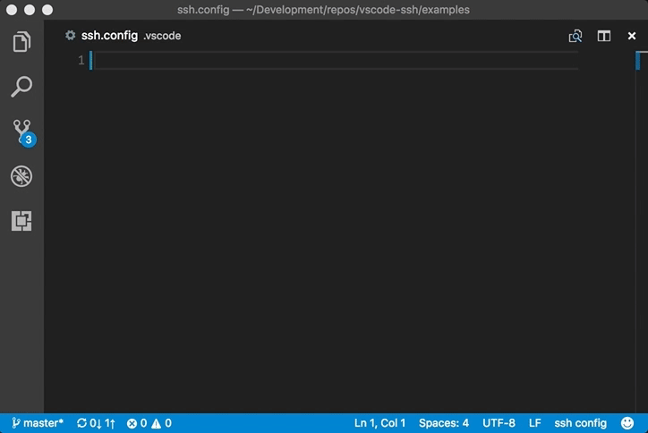

## Features

Edit the SSH config file with syntax coloring, content assist and snippets. Launch SSH with host configurations from the config file. Supports folder specific configuration files.

## Release Notes

### 0.0.1

- Initial release.

## License

[MIT](LICENSE)

Options were extraced from OpenSSH's man page under OpenSSH's [license](thirdparty/LICENSE).
